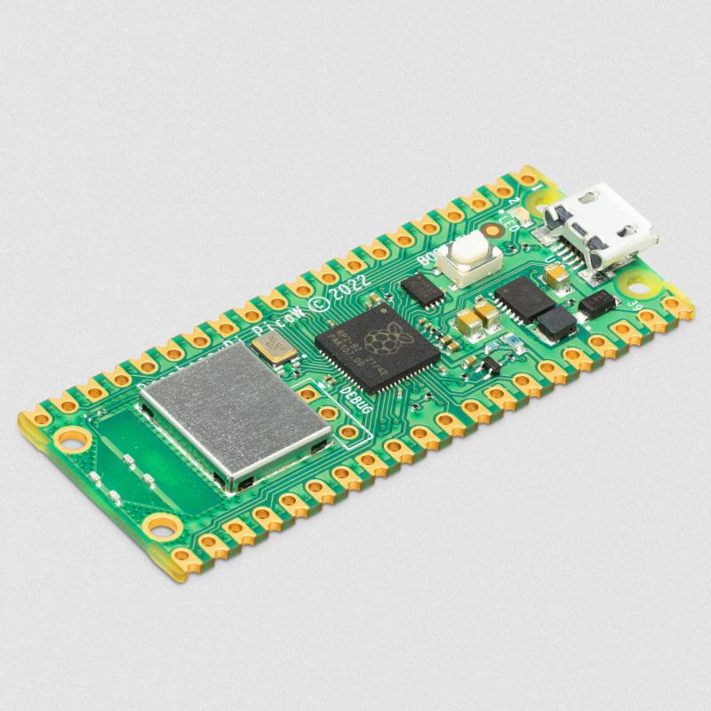

# Introdução

Este relatório tem como objetivo caracterizar o sistema embarcado Raspberry Pi Pico W, que é uma parte essencial do laboratório de nossa disciplina. Realizando uma análise detalhada desse componente, documentando suas especificações, interfaces de comunicação e, finalmente, demonstrar a aplicação prática dessas informações por meio de uma prova de conceito. O sistema embarcado Raspberry Pi Pico W é conhecido por sua versatilidade e ampla gama de aplicações, tornando-se um tópico de grande relevância.

# Materiais e Métodos

Para a elaboração do relatório, foi utilizado um simulador online chamado Wokwi, uma plataforma amplamente reconhecida por sua robustez e facilidade de uso no desenvolvimento de projetos de hardware e software. Este simulador se revelou particularmente adequado para a integração com o Raspberry Pi Pico W, um microcontrolador amplamente utilizado na comunidade de desenvolvedores.

No âmbito deste projeto, foi configurado e conectado com sucesso quatro botões ao Raspberry Pi Pico W, representando um exemplo prático da interação entre outros componentes com o microcontrolador. Cada botão foi devidamente programado para executar uma ação específica quando pressionado, demonstrando assim a capacidade do Raspberry Pi Pico W de receber entradas e processá-las de acordo com as instruções programadas.

Uma das funcionalidades implementadas neste relatório foi a geração de saudações em diferentes idiomas no terminal. Isso foi alcançado através da escrita de código em linguagem C/C++, uma escolha amplamente reconhecida pela eficiência e versatilidade que essa linguagem proporciona no contexto de desenvolvimento para microcontroladores.

# Desenvolvimento

## Características Gerais

A Raspberry Pi Pico W é um sistema que oferece diversas combinações em uma única placa, incluindo processador, memória, entradas, saídas e diversos recursos. Este sistema é conhecido como um Computador de Placa Única.

Ela opera com o sistema operacional Linux e é baseada em microcontroladores, sendo projetada para a conexão de sensores e dispositivos.

O Raspberry Pi Pico W é equipado com uma interface sem fio de banda única de 2,4 GHz (802.11n) usando o CYW43439 da Infineon. Esta interface oferece conectividade sem fio na faixa de 2,4 GHz, com suporte a recursos como WPA3 e a capacidade de operar como ponto de acesso para até quatro clientes. Além disso, o dispositivo integra o Bluetooth 5.2, com suporte para funções Bluetooth LE Central e Periférico, além do Bluetooth Classic. O Pico W também conta com uma antena incorporada licenciada pela ABRACON.



## Pinos

Ele contém um total de 40 pinos, sendo distribuída em 20 para cada lado, 28 delas são para usos gerais tanto de entrada quanto de saída e 8 GNDs (Ground - Caminho de retorno comum), alguns pinos têm como o intuito funcionalidades internas da placas, exemplo são os leds internos que vem integrado ao Pico.

Além disso, o Raspberry contém pinos que oferecem maior potência, conhecidos como pinos de alimentação, tendo 3v3(OUT), VSYS (External Power Input), VBUS (USB Power Input), 3V3_EN (Habilitação SMPS), ADC_REF (Tensão de alimentação do pino ADC), AGND (referência GND para os pinos ADC) e RUN (Pino de ativação).

O Raspberry Pi Pico W possui 8 geradores PWM, modulação por largura de pulso com o intuito de fazer o controle da tensão, independentes chamados slices. Cada fatia tem dois canais (A e B), o que perfaz um total de 16 canais PWM.

Também possui 5 Pinos analógicos, nos quais apenas 4 são acessíveis, pois ele tem um sensor de temperatura integrado, podendo transformar um sinal analógico em um sinal digital como um número que varia de 0 a 4095, ou seja, uma resolução de 12 bits.

Outros pinos são I2C, SPI e UART.


## Comunicação

O Raspberry Pi Pico W possui uma entrada USB na qual pode ser conectado ao computador para que possa ser transferido os códigos elaborados pelos programadores.

O código que fará o entendimento da comunicação dos componentes e qual ação será executada pode ser feito em:

C/C++: Sendo muito comum utilizar a IDE do Arduino.


Python: Sendo muito comum utilizar o compilador chamado MicroPython.


Essas não são as únicas opções, entretanto são as mais famosas. Outra maneira é utilizar um simulador online como WokWi.

Outro ponto importante é que o Raspberry deve estar conectado em uma fonte de alimentação para ser utilizado, podendo ser notebook ou em um power bank. 

# Prova de conceito

Foi criado um sistema com 4 botões das cores laranja, amarelo, azul e roxo, que ao clicar em determinado botão, irá aparecer uma saudação em um idioma sendo correspondente com aquele botão sendo português, espanhol, inglês e japonês.

Essa saudação irá aparecer no terminal da IDE, no caso do WokWi.

Para conectar os botões é necessário colocar no código fonte o número dos pinos em que cada botão está conectado (Pinos de uso gerais - Representado pelos fios coloridos), sendo necessário todos eles estarem conectado ao GND (Neutro - Representado pelo fio preto).


## Botão laranja

No terminal irá imprimir a mensagem em português "Ola":


## Botão Amarelo

No terminal irá imprimir a mensagem em espanhol "Hola":


## Botão Azul

No terminal irá imprimir a mensagem em inglês "Hello":


## Botão Roxo

No terminal irá imprimir a mensagem em japonês "Konnichiwa":


## Código fonte

Para elaborar esse sistema, foi utilizado a linguagem C/C++

```
const int buttonPins[] = {11, 10, 6, 5};
bool buttonState[4] = {false, false, false, false};

void setup() {
  for (int i = 0; i < 4; i++) {
    pinMode(buttonPins[i], INPUT_PULLUP);
  }
  Serial.begin(9600);
}

void loop() {
  for (int i = 0; i < 4; i++) {
    // Read the state of each button
    buttonState[i] = digitalRead(buttonPins[i]) == 0;

    if (buttonState[i]) {
      // Print a message based on the button that is pressed
      switch (i) {
        case 0:
          Serial.println("Ola");
          break;
        case 1:
          Serial.println("Hola");
          break;
        case 2:
          Serial.println("Hello");
          break;
        case 3:
          Serial.println("Konnichiwa");
          break;
      }
    }
  }
}

```

# Conclusão

O Raspberry Pi Pico W é uma placa versátil e poderosa. Com sua ampla gama de pinos, conectividade sem fio, e suporte a várias linguagens de programação, como na prova de conceito que foi utilizado 4 botões.

A prova de conceito apresentada, demonstra a aplicação prática do Raspberry Pi Pico W em um cenário de interação multilíngue. A capacidade de responder a diferentes entradas com saudações em idiomas.

Em resumo, o Raspberry Pi Pico W é uma ferramenta valiosa para projetos de eletrônica, automação e IoT, oferecendo um vasto leque de recursos e possibilidades de programação, tornando-o uma escolha excelente para desenvolvedores.
